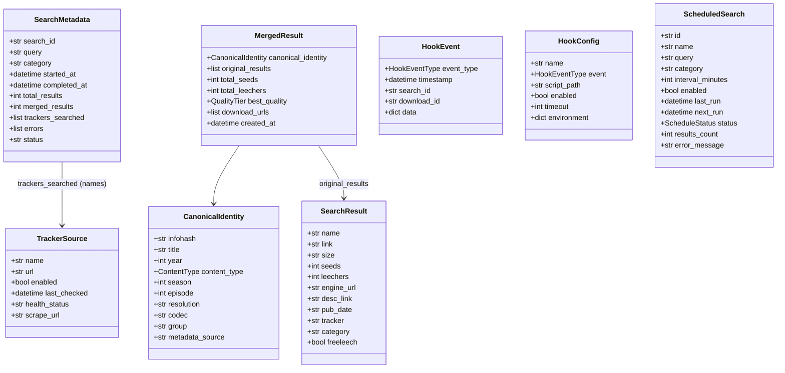

# Data Model

qBittorrent-Fixed has **no relational database**. All persistent state
lives in qBittorrent itself (handled by the upstream image) and in a
handful of JSON files under `config/`. The runtime data model is
therefore a set of Python dataclasses (for internal state) and Pydantic
models (for API request / response bodies).

This document enumerates them, their fields, and their lifecycle.
Every class below was verified against the source tree — if you edit
the model, update this document in the same PR.

## Overview

## Dataclasses (internal state)

All dataclasses live in `download-proxy/src/merge_service/`.

### `SearchMetadata`

File: `search.py:150`

Lifecycle: created in `SearchOrchestrator.search()`, stored in
`_active_searches[search_id]`, returned from the API once the status
is `completed` or `failed`.

| Field | Type | Meaning |
|---|---|---|
| `search_id` | `str` | UUID generated at search start |
| `query` | `str` | Original search query |
| `category` | `str` | Category filter; default `"all"` |
| `started_at` | `datetime` | UTC, auto-populated |
| `completed_at` | `Optional[datetime]` | UTC, set when status leaves `"running"` |
| `total_results` | `int` | Sum of raw per-tracker counts |
| `merged_results` | `int` | Count after deduplication |
| `trackers_searched` | `List[str]` | Tracker names that were attempted |
| `errors` | `List[str]` | `"<tracker>: <message>"` strings |
| `status` | `str` | `"running"`, `"completed"`, `"failed"` |
| `tracker_stats` | `Dict[str, TrackerSearchStat]` | Per-tracker run-time diagnostics; serialised as a sorted list in `to_dict()` |

### `TrackerSearchStat`

File: `search.py:~150`

Lifecycle: one instance per enabled tracker, created synchronously in
`SearchOrchestrator.start_search()` (so the first HTTP response already
lists every tracker that will be hit) and mutated in place by
`_run_search()` as the tracker transitions
`pending → running → success | empty | error | timeout | cancelled`.
Exposed through `SearchResponse.tracker_stats` on all three search
endpoints and streamed via SSE as `tracker_started` (pending→running)
and `tracker_completed` (any terminal flip) events.

| Field | Type | Meaning |
|---|---|---|
| `name` | `str` | Tracker identifier (e.g. `"rutracker"`) |
| `tracker_url` | `str` | Base URL of the tracker |
| `status` | `str` | `"pending"`, `"running"`, `"success"`, `"empty"`, `"error"`, `"timeout"`, `"cancelled"` |
| `results_count` | `int` | Raw row count for this tracker's run |
| `started_at` | `Optional[datetime]` | UTC; set on pending→running |
| `completed_at` | `Optional[datetime]` | UTC; set on terminal flip |
| `duration_ms` | `Optional[int]` | Wall-clock milliseconds |
| `error` | `Optional[str]` | Exception message, when `status == "error" \| "timeout"` |
| `error_type` | `Optional[str]` | Exception class name (`"RuntimeError"`, `"TimeoutError"`, …) |
| `authenticated` | `bool` | `True` when a cached session exists or credentials env-vars are set |
| `attempt` | `int` | Retry counter (currently always 1; reserved for future retries) |
| `http_status` | `Optional[int]` | HTTP status from the plugin when surfaced |
| `category` | `str` | The `category` filter value used for this run |
| `query` | `str` | The user query |
| `notes` | `Dict[str, Any]` | Free-form diagnostics a plugin can stash for the dashboard dialog |

### `SearchResult`

File: `search.py:82`

Lifecycle: produced by each tracker's search method, stored in
`_tracker_results[search_id][tracker_name]`, aggregated into
`MergedResult` by the deduplicator.

| Field | Type | Meaning |
|---|---|---|
| `name` | `str` | Torrent title |
| `link` | `str` | Download URL (`.torrent` or magnet) |
| `size` | `str` | Human-readable size (`"1.2 GB"`) |
| `seeds` | `int` | Current seeders; negative values clamped to 0 |
| `leechers` | `int` | Current leechers |
| `engine_url` | `str` | Base URL of the source tracker |
| `desc_link` | `Optional[str]` | Permalink to the description page |
| `pub_date` | `Optional[str]` | Publication date as returned by the tracker |
| `tracker` | `Optional[str]` | Tracker identifier (e.g. `"rutracker"`, `"iptorrents"`) |
| `category` | `Optional[str]` | Category string |
| `freeleech` | `bool` | IPTorrents-specific; drives `[free]` display suffix |

`to_dict()` adds `tracker_display` (`"<tracker> [free]"` when
`freeleech`, else `"<tracker>"`).

### `MergedResult`

File: `search.py:119`

Lifecycle: produced by `Deduplicator.merge_results()`, stored in
`_last_merged_results[search_id]`, serialised into
`SearchResultResponse`.

| Field | Type | Meaning |
|---|---|---|
| `canonical_identity` | `CanonicalIdentity` | Normalised fingerprint used for dedup |
| `original_results` | `List[SearchResult]` | All source rows that collapsed into this merge |
| `total_seeds` | `int` | Sum of seeds across sources |
| `total_leechers` | `int` | Sum of leechers across sources |
| `best_quality` | `Optional[QualityTier]` | Computed from sources; filled post-dedup |
| `download_urls` | `List[str]` | Unique URLs from the sources |
| `created_at` | `datetime` | UTC, auto-populated |

### `CanonicalIdentity`

File: `search.py:54`

Lifecycle: computed by the deduplicator when normalising a result; the
stable key used for matching across trackers.

| Field | Type | Meaning |
|---|---|---|
| `infohash` | `Optional[str]` | BitTorrent infohash (when the source exposes it) |
| `title` | `Optional[str]` | Normalised title |
| `year` | `Optional[int]` | Release year (strict `\b(19\|20)\d{2}\b` match) |
| `content_type` | `Optional[ContentType]` | Enum: movie, tv, anime, music, audiobook, game, software, ebook, other, unknown |
| `season` | `Optional[int]` | TV season number |
| `episode` | `Optional[int]` | TV episode number |
| `resolution` | `Optional[str]` | `"1080p"`, `"4K"`, … |
| `codec` | `Optional[str]` | `"x264"`, `"HEVC"`, … |
| `group` | `Optional[str]` | Release group |
| `metadata_source` | `Optional[str]` | `"omdb"`, `"tmdb"`, `"imdb"`, … |

### `TrackerSource`

File: `search.py:34`

Lifecycle: built on demand by
`SearchOrchestrator._get_enabled_trackers()`; not persisted.

| Field | Type | Meaning |
|---|---|---|
| `name` | `str` | Tracker identifier |
| `url` | `str` | Base URL |
| `enabled` | `bool` | Whether to search |
| `last_checked` | `Optional[datetime]` | Last health probe |
| `health_status` | `str` | `"healthy"`, `"degraded"`, `"offline"`, `"unknown"` |
| `scrape_url` | `Optional[str]` | BEP 48 scrape endpoint |

### `ContentType`, `QualityTier`

File: `search.py:11, 24`

Enums used as the canonical vocabulary for content classification and
quality tiers. Values exactly as they appear in the source:

- `ContentType`: `movie`, `tv`, `anime`, `music`, `audiobook`, `game`,
  `software`, `ebook`, `other`, `unknown`.
- `QualityTier`: `sd`, `hd`, `full_hd`, `uhd_4k`, `uhd_8k`, `unknown`.

### `MatchResult` (deduplicator)

File: `deduplicator.py:31`

Intermediate result from a match attempt between two `SearchResult`s.

| Field | Type | Meaning |
|---|---|---|
| `is_match` | `bool` | Are they the same torrent? |
| `confidence` | `float` | 0.0–1.0 similarity score |
| `tier` | `int` | 1 (strongest, e.g. infohash) — 4 (weakest, e.g. fuzzy title) |
| `reason` | `str` | Human-readable reason used in logs |

### `MetadataResult` (enricher)

File: `enricher.py:21`

Result of an external metadata lookup (OMDb / TMDB / TVMaze / AniList /
MusicBrainz / OpenLibrary).

| Field | Type | Meaning |
|---|---|---|
| `source` | `str` | Provider name (`"OMDb"`, `"TMDB"`, …) |
| `title` | `str` | Canonical title |
| `year` | `Optional[int]` | Release year |
| `content_type` | `Optional[str]` | `"movie"`, `"tv"`, `"music"`, `"book"` |
| `imdb_id` | `Optional[str]` | — |
| `tmdb_id` | `Optional[str]` | — |
| `anilist_id` | `Optional[str]` | — |
| `musicbrainz_id` | `Optional[str]` | — |
| `openlibrary_id` | `Optional[str]` | — |
| `poster_url` | `Optional[str]` | — |
| `overview` | `Optional[str]` | Plot or blurb |
| `genres` | `List[str]` | Defaults to `[]` via `__post_init__` |

### `ScrapeResult`, `TrackerStatus` (validator)

File: `validator.py:30, 40`

| Field | Type | Meaning |
|---|---|---|
| `tracker` | `str` | Tracker identifier |
| `status` | `TrackerStatus` | Enum: `healthy`, `degraded`, `offline`, `unknown` |
| `seeds` | `int` | From scrape response |
| `leechers` | `int` | From scrape response |
| `complete` | `int` | From scrape response |
| `error` | `Optional[str]` | Message if scrape failed |
| `scrape_time_ms` | `int` | Wall-clock scrape duration |

### Hook types (`merge_service/hooks.py`)

`HookEventType` — enum of eight event types: `search_start`,
`search_progress`, `search_complete`, `download_start`,
`download_progress`, `download_complete`, `merge_complete`,
`validation_complete`.

`HookEvent` (file: `hooks.py:38`)

| Field | Type | Meaning |
|---|---|---|
| `event_type` | `HookEventType` | Which event fired |
| `timestamp` | `datetime` | Auto-populated UTC |
| `search_id` | `Optional[str]` | Correlation ID |
| `download_id` | `Optional[str]` | Correlation ID |
| `data` | `Dict[str, Any]` | Event-specific payload |

`HookConfig` (file: `hooks.py:58`)

| Field | Type | Meaning |
|---|---|---|
| `name` | `str` | Display name |
| `event` | `HookEventType` | Which event to listen on |
| `script_path` | `str` | Executable path; validated via `os.path.exists` |
| `enabled` | `bool` | Default `True` |
| `timeout` | `int` | Seconds, default 30 |
| `environment` | `Dict[str, str]` | Extra env vars injected into the script |

Hooks persist at `/config/download-proxy/hooks.json` (see
`api/hooks.py`).

### `ScheduledSearch`, `ScheduleStatus`

File: `scheduler.py:22, 32`

Lifecycle: loaded from `/config/merge-service/scheduling.json`, kept
in `Scheduler._scheduled_searches` during runtime.

| Field | Type | Meaning |
|---|---|---|
| `id` | `str` | UUID |
| `name` | `str` | Display name |
| `query` | `str` | Query to re-run |
| `category` | `str` | Default `"all"` |
| `interval_minutes` | `int` | Default 60 |
| `enabled` | `bool` | — |
| `last_run` | `Optional[datetime]` | — |
| `next_run` | `Optional[datetime]` | — |
| `status` | `ScheduleStatus` | `active`, `paused`, `completed`, `failed` |
| `results_count` | `int` | Last run's merged count |
| `error_message` | `Optional[str]` | Last error |

## Pydantic models (API surface)

Request / response bodies under `download-proxy/src/api/`.

### `api/routes.py`

- `SearchRequest` — `{query, category, limit (1..100), enable_metadata,
  validate_trackers, sort_by, sort_order}`.
- `SearchResultResponse` — `{name, size, seeds, leechers,
  download_urls, quality?, content_type?, desc_link?, tracker?,
  sources, metadata?, freeleech}`.
- `SearchResponse` — `{search_id, query, status, results,
  total_results, merged_results, trackers_searched, started_at,
  completed_at?}`.
- `DownloadRequest` — `{result_id, download_urls}`.
- `QBitLoginRequest` (inner, line 369) — `{username, password,
  remember?}`.
- `MagnetRequest` (inner, line 675) — magnet-generation request.

### `api/hooks.py`

- `HookCreateRequest` — `{name, event, script_path, enabled, timeout
  (1..300), environment}`.
- `HookResponse` — `{hook_id, name, event, script_path, enabled,
  timeout, created_at}`.

### `api/auth.py`

- `CaptchaLoginRequest` — `{cap_sid, cap_code_field, captcha_text,
  captcha_token}`.
- `CookieLoginRequest` — `{cookie_string}`.

**Note:** The in-memory CAPTCHA challenge is **not** a distinct
dataclass. It is stored as an anonymous `dict` in
`_pending_captchas: dict = {}` at `api/auth.py:24`. Verified: no
`CaptchaChallenge` class exists in the repo.

### `api/scheduler.py`

- `ScheduleCreateRequest` — fields for creating a `ScheduledSearch`.
- `ScheduleUpdateRequest` — partial update payload.

## JSON persistence

| Path | Owner | Structure |
|---|---|---|
| `/config/download-proxy/hooks.json` | `api/hooks.py` | Array of `HookConfig` dicts |
| `/config/download-proxy/qbittorrent_creds.json` | `api/routes.py` | `{username, password}` |
| `/config/merge-service/scheduling.json` | `merge_service/scheduler.py` | Array of `ScheduledSearch` dicts |

## Why no relational DB?

- The merge service is a stateless orchestrator over tracker APIs;
  durable state would duplicate what qBittorrent already tracks.
- Adding Postgres / SQLite would violate constitution Principle I
  (Container-First — the product is exactly two containers).
- Query surface is tiny (CRUD over 2–3 JSON files); the cognitive cost
  of a schema layer is higher than the benefit.

## Gotchas

- All datetimes are UTC; the `to_dict()` serialisers call `.isoformat()`.
- `SearchMetadata.errors` is a plain string list. The tracker name is
  embedded as `"<name>: <msg>"`, not in a separate field.
- `SearchResult.freeleech` matters only for IPTorrents; other trackers
  leave it `False`. The deduplicator uses this to forbid merging a
  non-freeleech IPTorrents row with any other source.
- `MergedResult.best_quality` is filled **post-dedup** by the enricher,
  not during initial construction.
- `_pending_captchas` lacks a TTL — this is a known leak, tracked in
  [`CONCURRENCY.md`](CONCURRENCY.md).
